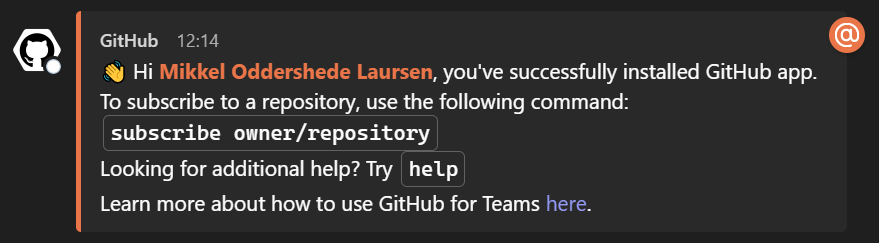
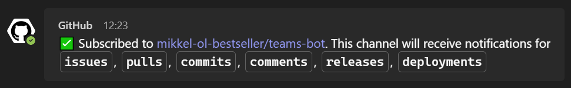
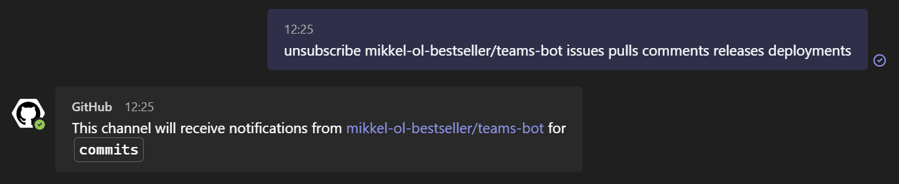
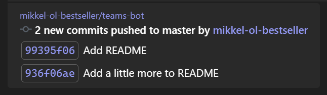

# Microsoft Teams GitHub bot

Start by adding the official Teams GitHub bot to your Teams applications

https://teams.microsoft.com/l/app/ca9e26b7-dce5-44a0-b2b7-a70a3d65ce25

After adding the bot you should receive a direct message looking something like this:

Answer it `signin` to sign in to your GitHub account

Click "Connect GitHub account" in the response message and give it access

Now the bot is ready to set up subscriptions to enable notification/messages for repositories

To add an subscribe type the following:

`subscribe owner/repo`

for example:

`subscribe mikkel-ol-bestseller/teams-bot`

This will enable notifications for all default features

To only enable notifications for commits, unsubscribe to all the other features:

`unsubscribe mikkel-ol-bestseller/teams-bot issues pulls comments releases deployments`

This should leave you with only `commits`:

Now only notifications for new commits to the main branch are enabled and they look like this:

This can of course be customized even more; to dive deeper into the possibilities ask the bot `help` or visit https://github.com/integrations/microsoft-teams/blob/master/Readme.md
